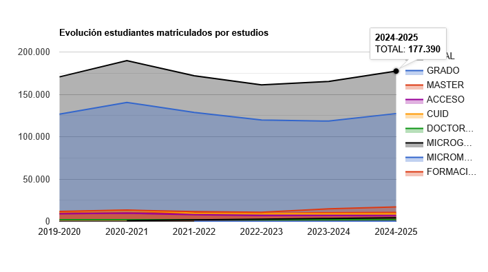
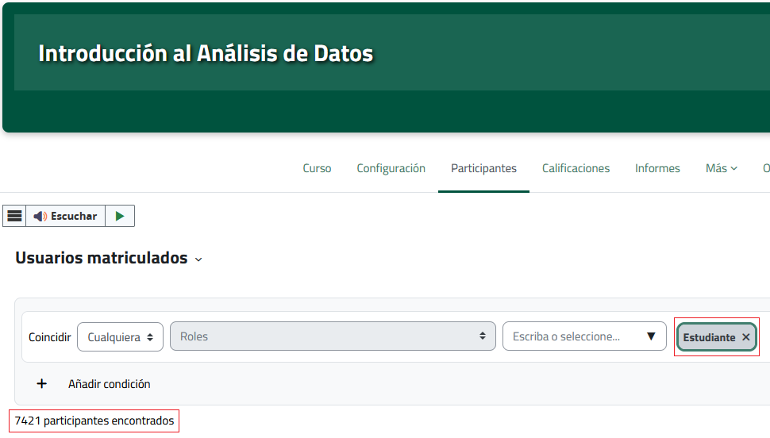

# Problem

```{r libraries}
#| cache:   false
#| include: false

library(knitr)
library(extrafont)
```

```{r setup}
#| cache:   false
#| include: false
opts_knit$set(root.dir = here::here()) # See lines 42-43
```

## Large-scale remote education



::: aside
([source: UNED Statistics portal](https://app.uned.es/evacaldos))
:::

::: notes
UNED: Remote education university in Spain, since 1972

Currently 177 thousand students signed up for higher education studies

Out of them 71,8% in 4-year Bachelor's degrees, i.e. 127 thousand

And out of them, 35 thousand are enrolled in the degree in Psychology
:::

## Large-scale remote education



::: aside
[source: UNED OpenLMS course](https://agora.uned.es)
:::

::: notes
In our introductory data analysis course, we have 7400 students enrolled

Continuous assessment activities are a challenge in this context
:::

## Large-scale remote education

Challenges: continuous assessment

-   Response leakage

-   Fraudulent responding

-   Failure of educational objectives

::: aside
[source: UNED OpenLMS course](https://agora.uned.es)
:::

::: notes
Continuous assessment activities are a challenge in this context.

If we want to create an assessment activity, there's the risk of response leakage (e.g. students who post on youtube all the solutions)

Therefore, many other students simply copy the responses from the leaked ones

This implies a failure to assess the learning and ultimately to attain the educational objectives of the task
:::

# Solution

## Personalized assessment activity

-   Same task

-   For each student: different data + responses

-   Synthetic, "random" (unique) dataset

-   Pilot study: Univariate linear regression in Jamovi

::: notes
Our proposed solution is to implement a task, which is the same for every student.

However, each of them has a pseudo-random, unique synthetic dataset.

In our pilot study, we ask them to run a very simple univariate linear regression in Jamovi, so they learn to use this statistical software and interpret the output.
:::

## Implementation

::: nonincremental
1.  Random dataset generator
:::

```{r}
#| code-line-numbers: "1|3|10-15"
#| eval:              false
simulate_data <- function(seed) {

  set.seed(seed)

  slope       <- sample(-1:1, size = 1L) # Simulation regression coefficient
  sample_size <- sample(SAMPLE_SIZE, size = 1L) # Random sample size
  n_crit_vals <- length(CRITERION_SCORES) # Nº of values in the criterion scores

  tibble::tibble(
    predictor = sample(
      PREDICTOR_SCORES,
      size    = sample_size,
      replace = TRUE
    ),
    criterion = (slope * predictor + rnorm(sample_size)) |>
      dplyr::ntile(n_crit_vals)                          |>
      dplyr::recode(!!!CRITERION_SCORES |> setNames(1:n_crit_vals))
  ) |>
    setNames(SIM_VAR_NAMES)
}
```

2.  Shiny app :::
